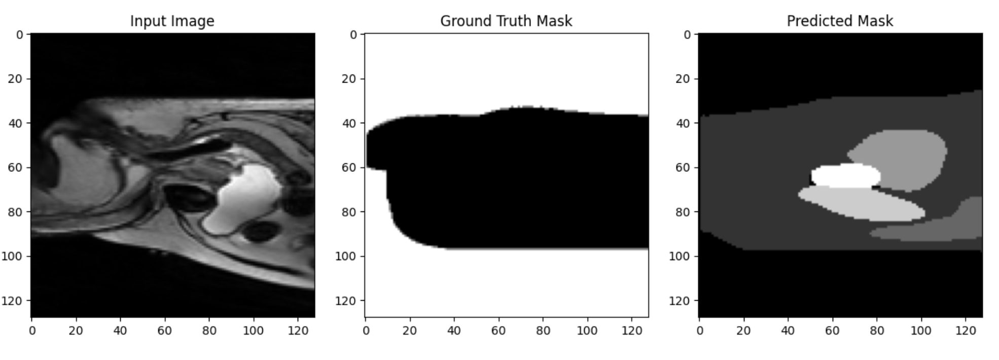

# 3D Unet for Prostate MRI Segmentation

## Overview

This project implements an Improved 3D Unet model using residuals that segments the Prostate MRI dataset. The purpose is to segment the downsampled dataset with a minumum Dice Score of 0.7 when testing. The algorithm identifies and segments the different regions of the scans to an accurate degree.

The dataset used contains 3D images of the prostate, which has been downsampled to a manageable size.

## Algorithm Description

The 3D UNet model is a full convolutional neural network which has been designed for 3D image segmentation. It uses the classic encoder-decoder architecture with the bottleneck.

- Encoder: The encoder captures features from the input and reduces the spatial dimensions to capture high-level features.
- Bottleneck: The bottleneck layer connects the encoder to the decoder which is the most dense layer of the input data.
- Decoder: The decoder upsamples the features back into the original spatial dimension while integrating the features from the encoder using skip connections.
- Residual Connections: Used residual blocks within the encoder and decoder to help reduce the vanishing gradient problem and allow for deeper networks to be trained.

The model is trained to maximise the Dice Similarity coefficient on the training data which is used to get accurate segmentation of the prostate. Data transformations are applied to improve the robustness and prevent overfitting, these include rotations, flips and resizing.

## Input and Output

The 3D model expects input as follows:

- Nifti files (.nii or .nii.gz)
- 1 grayscale input channel
- Preprocessing (resizing)

The output is expected to be:

- a tensor with dimensions (128, 128, 128)
- 6 channels representing the different prostate classes
- Post-processing to assign probabilities to classes



## Preprocessing

The 3D MRI images are resized to dimensions (128, 128, 128) to ensure the model is consistent for all images.
The data is also augmented which means the data is normalised and flipped during the training process.
The data is split as follows:

- Training: 70%
- Validation: 20%
- Testing: 10%

## Dataset Access

The 3D Prostate MRI dataset used in this project is stored in `/home/groups/comp3710/HipMRI_Study_open` on the Rangpur HPC cluster.

If you want to run the code locally, download the dataset from [this link](https://data.csiro.au/collection/csiro:51392v2?redirected=true) and modify the path in dataset.py

## Dependencies

To run this project, you will need the following dependencies:

| Library     | Version |
| ----------- | ------- |
| Python      | 3.8+    |
| PyTorch     | 1.10+   |
| Torchvision | 0.11+   |
| Nibabel     | 3.2+    |
| NumPy       | 1.19+   |
| Matplotlib  | 3.4+    |

All dependencies are required to reproduce the results. Which can be installed with the following command:

```bash
pip install -r requirements.txt
```

## Example Usage

python train.py
